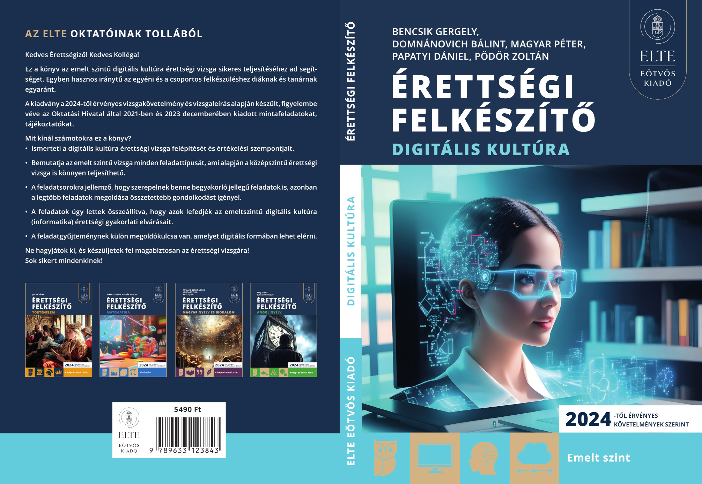

# Források és megoldások - ELTE Digitális kultúra - Érettségi felkészítő gyakorlati feladatsorok - Emelt Szint (2024)

Ez a repository tartalmazza a forrásokat és megoldásokat az 
ELTE Digitális kultúra - Érettségi felkészítő gyakorlati feladatsorok - Emelt Szint (2024) könyvhöz.

## Szerzők

Bencsik Gergely, Domnánovich Bálint, Magyar Péter, Papatyi Dániel, Pödör Zoltán\
© Szerzők, 2024

ISBN: 978-963-312-384-3

Felelős kiadó: ELTE Eötvös Kiadó ügyvezető igazgatói\
Projektvezető: Csanádi-Egresi Nóra\
Műszaki szerkesztő: Farkas Milán\
Tipográfia,tördelés: Balázs Andrea\
Borító: Vilimi Katalin Orsolya\
Nyomda: Multiszolg
